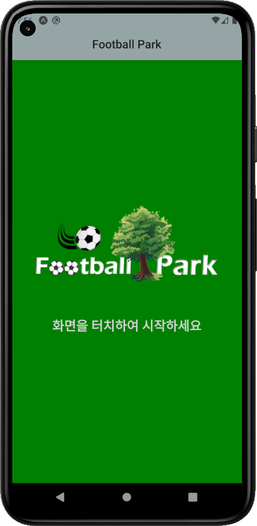
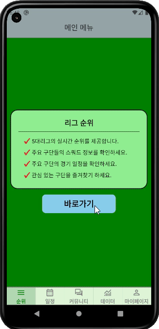
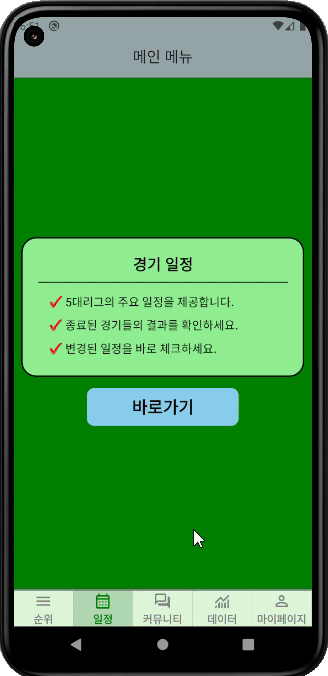
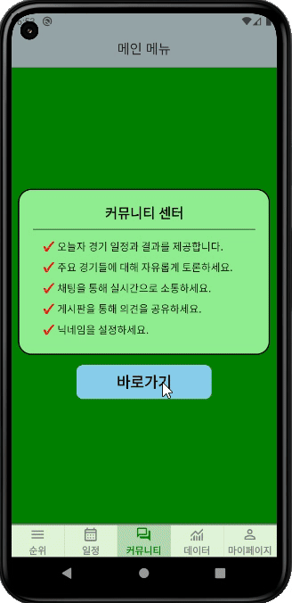
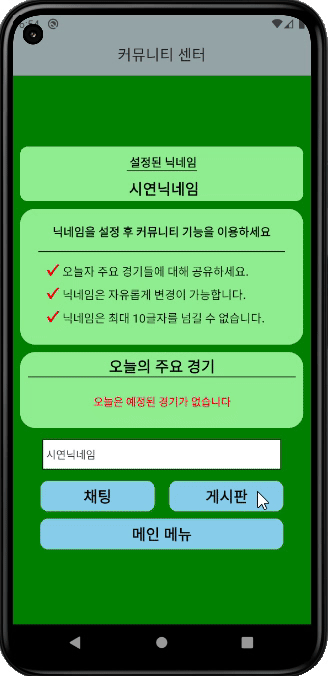
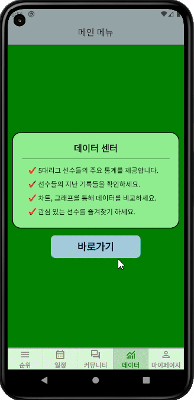
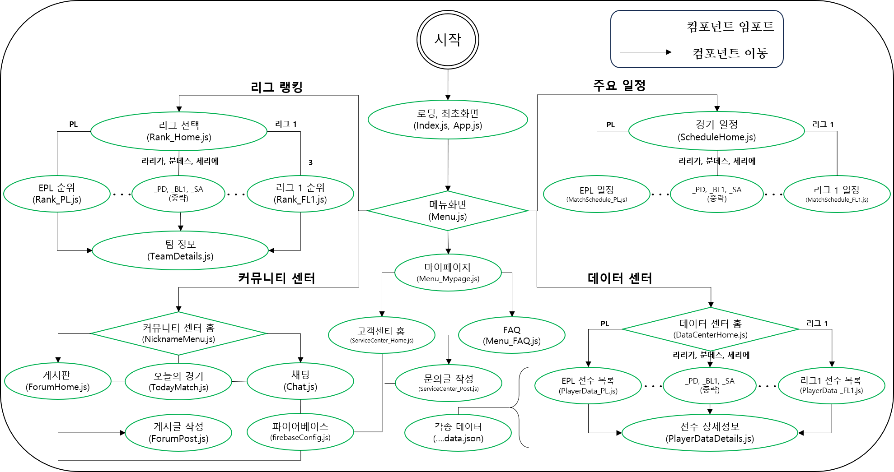
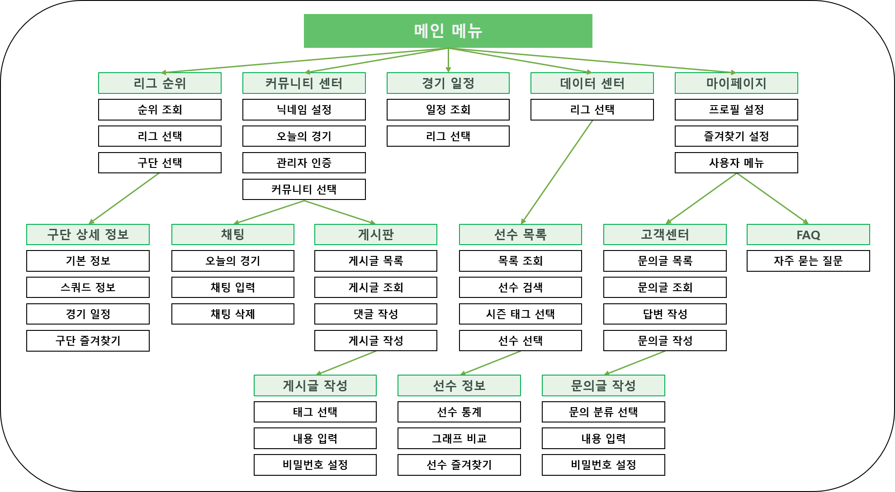

# :deciduous_tree:FootballPark

## :bulb:프로젝트 소개

**프로젝트 기간** : 2024.09 ~ 2024.11 
**인원** : 1인  
해외축구 주요 데이터를 열람하고 여러 사람들과 커뮤니티를 즐길 수 있는 앱으로,
React-Native와 [FootballDataAPI](https://www.football-data.org/)를 이용하여 제작되었습니다.

## :clipboard:기술스택

## :computer:주요화면
### 리그순위

- 해외 5대리그의 실시간 순위표를 제공합니다.
- 주요 팀들의 상세 정보 및 일정을 제공합니다.
- 관심있는 구단 즐겨찾기 기능을 제공합니다.

### 리그별일정

- 해외 5대리그의 경기 일정 및 실시간 스코어 정보를 제공합니다.

### 커뮤니티 센터 : 채팅

- 진행중인 경기의 실시간 스코어 정보를 제공합니다.
- 실시간 경기 스코어를 확인하며 불특정 다수의 사람들과 오픈 채팅을 즐길 수 있습니다.

### 커뮤니티 센터 : 게시판

- 닉네임을 설정하고 다양한 주제의 게시글을 작성할 수 있습니다.
- 각 게시글에 댓글을 작성할 수 있습니다.
- 비밀번호를 설정하고, 비밀번호를 입력하여 게시글을 삭제할 수 있습니다.

### 데이터 센터

- 사용자가 원하는 리그, 시즌, 선수를 선택 및 검색하여 주요 데이터를 조회할 수 있습니다.
- 수치 데이터와 시각화 데이터 두 가지를 모두 제공합니다.
- 관심있는 선수 즐겨찾기 기능을 제공합니다.

### 마이페이지

- 프로필사진, 닉네임, 즐겨찾기 정보를 관리할 수 있습니다.
- FAQ, 고객센터 등 각종 사용자 편의 기능을 제공합니다.

## :mag:앱 구조 및 흐름

- 컴포넌트 구조

- 앱 흐름도

## :notebook:비고
